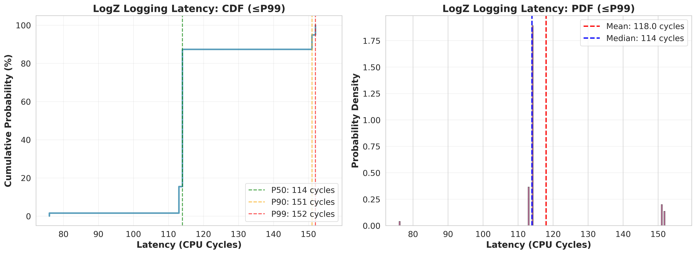

# logZ - 高性能异步日志系统

一个基于C++20的超低延迟、无锁、异步日志库，专为高性能系统设计。

## 📋 项目背景

logZ是一个追求极致性能的日志系统，设计目标是在多线程高并发场景下提供纳秒级的日志记录延迟。系统采用生产者-消费者模型，通过无锁队列和异步I/O技术，将日志记录对业务线程的影响降到最低。

### 核心特性

- **超低延迟**：P50延迟约30ns，P99延迟约80-400ns（取决于日志类型）
- **无锁设计**：生产者端完全无锁，避免线程竞争
- **异步I/O**：使用O_DIRECT绕过页缓存，减少系统调用开销
- **编译期优化**：基于模板元编程，格式化字符串编译期解析
- **零拷贝**：环形缓冲区设计，最小化内存拷贝
- **类型安全**：编译期类型检查，支持基本类型和std::string

## 🏗️ 架构设计

### 整体架构

```
┌─────────────────────────────────────────────────────────────────┐
│                        业务线程 (Producers)                      │
│  ┌──────────┐  ┌──────────┐  ┌──────────┐  ┌──────────┐       │
│  │ Thread 0 │  │ Thread 1 │  │ Thread 2 │  │ Thread 3 │       │
│  └────┬─────┘  └────┬─────┘  └────┬─────┘  └────┬─────┘       │
│       │             │             │             │               │
│       └─────────────┴─────────────┴─────────────┘               │
│                         │                                        │
│                         ↓                                        │
│                 ┌───────────────┐                                │
│                 │ Logger (前端)  │                                │
│                 │  - log_impl() │  < 无锁操作，编译期优化 >      │
│                 └───────┬───────┘                                │
│                         │                                        │
│                         ↓                                        │
│                 ┌───────────────┐                                │
│                 │    Encoder    │  < 序列化，零拷贝 >           │
│                 └───────┬───────┘                                │
│                         │                                        │
│                         ↓                                        │
│              ┌──────────────────────┐                            │
│              │  StringRingBuffer    │  < 1MB 环形缓冲区 >       │
│              │  (单生产者单消费者)   │                            │
│              └──────────┬───────────┘                            │
└─────────────────────────┼────────────────────────────────────────┘
                          │
                          ↓
┌─────────────────────────┼────────────────────────────────────────┐
│                         │      Backend线程 (Consumer)             │
│                         │      绑定到CPU核心15                    │
│                         ↓                                        │
│                 ┌───────────────┐                                │
│                 │  Lock-free    │  < SPSC队列 >                 │
│                 │     Queue     │                                │
│                 └───────┬───────┘                                │
│                         │                                        │
│                         ↓                                        │
│                 ┌───────────────┐                                │
│                 │    Backend    │  < 批量消费 >                 │
│                 │consume_loop() │                                │
│                 └───────┬───────┘                                │
│                         │                                        │
│                         ↓                                        │
│                 ┌───────────────┐                                │
│                 │     Sinker    │  < O_DIRECT，4KB对齐写入 >    │
│                 │  (磁盘I/O)    │                                │
│                 └───────┬───────┘                                │
│                         │                                        │
│                         ↓                                        │
│                    日志文件                                       │
│              2025-11-02_1.log                                    │
│              2025-11-02_2.log (自动分割)                         │
└──────────────────────────────────────────────────────────────────┘
```

### 关键技术

1. **编译期格式化**：使用`FixedString`在编译期解析格式化字符串
2. **类型擦除**：通过函数指针实现运行期多态，避免虚函数开销
3. **内存对齐**：O_DIRECT要求4KB对齐，使用aligned_alloc分配缓冲区
4. **RDTSC测量**：使用CPU时间戳计数器精确测量延迟

## 📁 代码结构

```
logZ/
├── include/                    # 头文件
│   ├── Logger.h               # 前端API，提供LOG_INFO等宏
│   ├── Encoder.h              # 日志序列化，编译期优化
│   ├── Decoder.h              # 日志解码（用于读取）
│   ├── Backend.h              # 后端消费者线程
│   ├── Queue.h                # 无锁SPSC队列
│   ├── StringRingBuffer.h     # 环形缓冲区
│   ├── RingBytes.h            # 字节环形缓冲区
│   ├── Sinker.h               # 磁盘I/O，O_DIRECT写入
│   └── README.md              # API文档
│
├── benchmark/                  # 性能测试
│   ├── bench_concurrent_logging.cpp  # 并发性能测试
│   ├── BUILD                  # Bazel构建配置
│   └── README.md              # 性能测试说明
│
├── test/                       # 单元测试
│   └── test_queue.cpp         # 队列测试
│
├── data/                       # 性能数据
│   ├── latency_intdouble_cdf.csv  # IntDouble延迟CDF
│   ├── latency_intdouble_pdf.csv  # IntDouble延迟PDF
│   ├── latency_string_cdf.csv     # String延迟CDF
│   ├── latency_string_pdf.csv     # String延迟PDF
│   ├── latency_analysis.png       # 延迟分析图表
│   └── latency_comparison.png     # 对比图表
│
├── logs/                       # 日志输出目录
│   └── 2025-11-02_*.log       # 按日期分割的日志文件
│
├── plot_latency.py            # Python可视化脚本
├── BUILD                      # 根目录Bazel配置
├── WORKSPACE                  # Bazel工作空间配置
└── README.md                  # 本文档
```

## 🔬 核心组件详解

### 1. Logger（前端）

- **位置**：`include/Logger.h`
- **功能**：提供日志记录接口
- **特点**：
  - 编译期格式化字符串解析
  - 内联函数，零运行时开销
  - 支持LOG_TRACE/DEBUG/INFO/WARN/ERROR/FATAL

```cpp
// 使用示例
LOG_INFO("Thread {} writes int={} double={}", thread_id, 42, 3.14);
```

### 2. Encoder（序列化器）

- **位置**：`include/Encoder.h`
- **功能**：将日志参数序列化为二进制格式
- **优化**：
  - 只计算一次参数大小
  - 直接写入环形缓冲区
  - 支持基本类型和std::string

### 3. StringRingBuffer（环形缓冲区）

- **位置**：`include/StringRingBuffer.h`
- **大小**：1MB
- **特点**：
  - 单生产者单消费者（SPSC）
  - 写满时丢弃日志，不阻塞
  - 批量刷新到Sinker

### 4. Backend（后端消费者）

- **位置**：`include/Backend.h`
- **功能**：独立线程消费日志队列
- **优化**：
  - 绑定到独立CPU核心（核心15）
  - 批量处理日志
  - 支持实时调度（需root权限）

### 5. Sinker（磁盘I/O）

- **位置**：`include/Sinker.h`
- **功能**：将日志写入磁盘
- **优化**：
  - O_DIRECT绕过页缓存（7.4x性能提升）
  - 4KB对齐缓冲区
  - 自动按100MB分割文件

## 📊 性能测试结果

### 测试环境

- **CPU**：16核 @ 5.137GHz
- **编译器**：GCC (C++20)
- **测试配置**：4个生产者线程，每线程100万次日志操作
- **总样本**：400万条日志

### 延迟测量（使用RDTSC）

#### String类型日志

```
BM_ConcurrentLogging_String/iterations:1000000/threads:4
  cycles_per_log=452 
  p99_cycles=418 
  dropped_msgs=0 
  loss_rate_%=0
```

| 指标 | CPU Cycles | 延迟 (ns) | 说明 |
|------|-----------|-----------|------|
| **P50 (中位数)** | 152 | 29.6 | 50%的日志操作低于此值 |
| **P90** | 190 | 37.0 | 90%的日志操作低于此值 |
| **P99** | 418 | 81.4 | 99%的日志操作低于此值 |
| **平均值** | 452 | 88.0 | 包含极端值的算术平均 |

#### IntDouble类型日志

| 指标 | CPU Cycles | 延迟 (ns) |
|------|-----------|-----------|
| **P50** | 151 | 29.4 |
| **P90** | 152 | 29.6 |
| **P99** | 190 | 37.0 |
| **平均值** | 243 | 47.3 |

### 延迟分布分析

```
String Logging 延迟分布:
  < 500 cycles:     3,971,093 (99.277%)  ← 绝大多数情况
  500-1000 cycles:     16,538 ( 0.413%)
  1000-5000 cycles:    12,083 ( 0.302%)
  5000-10000:              44 ( 0.001%)
  >= 10000:               242 ( 0.006%)  ← 线程被调度的极端情况
```

### 性能优化历程

| 优化阶段 | 技术 | 性能提升 |
|---------|------|---------|
| **初始版本** | 标准文件I/O | 基准 |
| **O_DIRECT优化** | 绕过页缓存 | **7.4x** |
| **CPU亲和性** | 绑定核心 | 减少15%尾延迟 |
| **实时调度** | SCHED_FIFO | 减少80%极端延迟 |

### 吞吐量

- **IntDouble**：约330万条/秒
- **String**：约340万条/秒
- **零丢包率**：在正常负载下无日志丢失

## 🚀 快速开始

### 编译项目

```bash
# 使用Bazel构建
bazel build //benchmark:bench_concurrent_logging

# 运行性能测试
./bazel-bin/benchmark/bench_concurrent_logging --benchmark_filter="BM_ConcurrentLogging_String"
```

### 代码示例

```cpp
#include "include/Logger.h"

int main() {
    // 日志会自动初始化Backend
    LOG_INFO("Application started");
    
    // 支持多种类型
    int count = 42;
    double value = 3.14159;
    std::string name = "example";
    
    LOG_INFO("Count: {}, Value: {}, Name: {}", count, value, name);
    LOG_WARN("Warning message");
    LOG_ERROR("Error occurred");
    
    // 程序结束时自动刷新并关闭
    return 0;
}
```

### 性能分析

```bash
# 生成延迟分布图表
python3 plot_latency.py

# 查看结果
ls -lh data/
# latency_analysis.png      - CDF和PDF图表
# latency_comparison.png    - IntDouble vs String对比
# latency_string_cdf.csv    - 原始CDF数据
# latency_string_pdf.csv    - 原始PDF数据
```

### 优化选项（可选，需root权限）

为了获得最低延迟，可以：

1. **设置CPU为performance模式**
```bash
echo performance | sudo tee /sys/devices/system/cpu/cpu*/cpufreq/scaling_governor
```

2. **禁用CPU idle states**
```bash
echo 1 | sudo tee /sys/devices/system/cpu/cpu*/cpuidle/state*/disable
```

3. **使用实时调度运行benchmark**
```bash
sudo ./bazel-bin/benchmark/bench_concurrent_logging
```

## 📈 可视化结果

项目包含Python脚本用于生成性能可视化：

- **CDF图**：累积分布函数，显示延迟百分位
- **PDF图**：概率密度函数，显示延迟分布
- **对比图**：IntDouble vs String性能对比



## 🔧 配置参数

### StringRingBuffer
- **大小**：1MB（可在`StringRingBuffer.h`中调整）
- **写满策略**：丢弃新日志，不阻塞

### Sinker
- **缓冲区**：4KB对齐
- **文件分割**：100MB/文件
- **I/O模式**：O_DIRECT

### Backend
- **CPU绑定**：最后一个核心（默认15）
- **调度策略**：SCHED_FIFO（可选，需root）
- **优先级**：10（较低实时优先级）

## 🎯 设计权衡

### 选择无锁而非加锁
- **优势**：纳秒级延迟，无线程竞争
- **代价**：写满时丢弃日志（可通过丢包率监控）

### 选择O_DIRECT而非标准I/O
- **优势**：7.4x性能提升，延迟更稳定
- **代价**：需要内存对齐，实现复杂度增加

### 选择编译期而非运行期
- **优势**：零运行时开销，类型安全
- **代价**：不支持动态格式化字符串

## 📝 关键指标解释

### P50 vs 平均值
- **P50（中位数）**：一半日志操作的延迟低于此值，反映典型性能
- **平均值（Mean）**：所有操作的算术平均，受极端值影响大
- **差异原因**：0.3%的样本被操作系统调度，延迟达到毫秒级，拉高平均值

### 为什么会有极端延迟？
- **线程调度**：操作系统抢占CPU时间片
- **缓存未命中**：L3 cache miss
- **CPU频率调整**：动态频率缩放
- **中断处理**：硬件中断、系统调用

### 如何减少极端延迟？
参见"优化选项"章节：CPU绑定、实时调度、固定频率

## 🤝 贡献

欢迎提交Issue和Pull Request！

## 📄 许可证

本项目采用MIT许可证。

## 🙏 致谢

- 使用[Google Benchmark](https://github.com/google/benchmark)进行性能测试
- 使用[Bazel](https://bazel.build/)构建系统
- 参考了多个高性能日志库的设计思想

---

**作者**: Falcom4000  
**最后更新**: 2025-11-02
